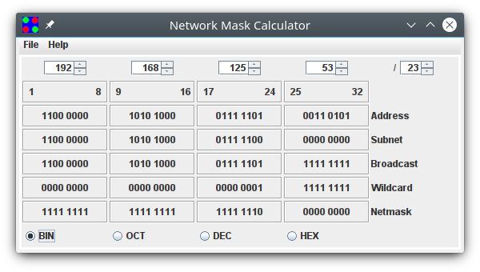
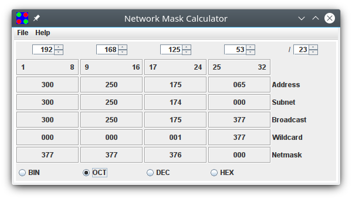
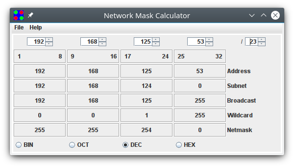
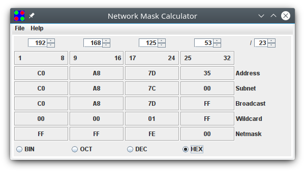

A simple netmask, network, broadcast & subnet calculator. 

To build and run...
1. CD into the src directory
2. javac -Xdiags:verbose maskcalc/*.java
3. jar -c -f maskcalc.jar -v -m MANIFEST.MF maskcalc/*.class maskcalc.png
4. java -jar maskcalc.jar
